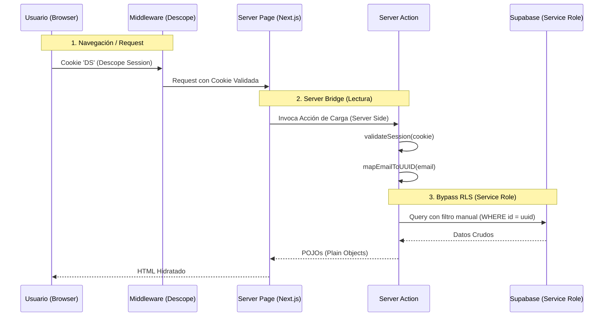

# Admin Protocol v2.0: The Master Architecture

**Estado**: VIGENTE
**Autoridad**: Jesus Sanchez
**Version**: 2.0 (Master Standard)
**Fecha**: 2026-02-12

---

## 🏛️ Principios Fundamentales

1.  **Ceguera del Cliente**: El frontend (React) es **ciego** a la identidad real. `auth.uid()` siempre es `null` o no confiable.
2.  **Omnisciencia del Servidor**: Solo el servidor (Server Actions) conoce la verdad via `validateSession` y `supabaseadmin`.
3.  **Puente de Identidad**: El único camino válido es: Cookie Descope -> Server Action -> Validación -> Mapeo Email/UUID -> Query Service Role.

---

## 🔄 Flujo de Datos (The Information Flow)

---

## ✅ Checklist de Refactorización (Por cada Página)

Para declarar una página como "Migrada a v2.0", debe cumplir:

### 1. Arquitectura de Archivos
- [ ] Convertir `page.tsx` a `async export default function Page()`.
- [ ] Eliminar `use client` del `page.tsx` raíz.
- [ ] Mover lógica de estado UI a `client-page.tsx` (solo si es estrictamente necesario).

### 2. Capa de Datos (Server Actions)
- [ ] Crear `actions.ts` específico para el módulo.
- [ ] **IMPORTANTE**: Usar `createClient` con `SUPABASE_SERVICE_ROLE_KEY`.
- [ ] Implementar `_getValidatedUser()` que retorne `{ uuid, email, rol }` o lance error.
- [ ] Reemplazar llamadas `supabase.from()` por llamadas a la función `_getValidatedUser()`.

### 3. Limpieza del Cliente
- [ ] **ELIMINAR** `createClientComponentClient` o `createClient` (browser) de los componentes.
- [ ] **ELIMINAR** `useEffect` para fetch de datos iniciales.
- [ ] **ELIMINAR** dependencia de `supabase.auth.getUser()`.

### 4. Preservación Visual (Política de Oro)
- [ ] **PROHIBIDO** modificar clases de Tailwind.
- [ ] **PROHIBIDO** alterar el layout JSX/TSX existente.
- [ ] El refactor es **quirúrgico**: solo cambia el origen de los datos, no cómo se ven.

---

## 🗺️ Mapa de Rutas y Estado

| Ruta | Estado | Acción Requerida |
| :--- | :--- | :--- |
| `/dashboard/perfil` | ✅ **BRIDGE v2.0** | Ninguna (Referencia) |
| `/dashboard/tareas` | ❌ **LEGACY** | **REFACTOR PRIORITARIO** |
| `/dashboard/obras` | ⚠️ **PENDIENTE** | Evaluar |
| `/dashboard/finanzas`| ⚠️ **PENDIENTE** | Evaluar |

---

## 🚨 Manejo de Errores (Fail Closed)

Si Descope falla o el usuario no existe en `public.usuarios`:
1.  **NO** intentar fallback a JWT.
2.  **NO** mostrar datos parciales.
3.  **SÍ** redirigir a `/login` o mostrar error 403 explícito.
